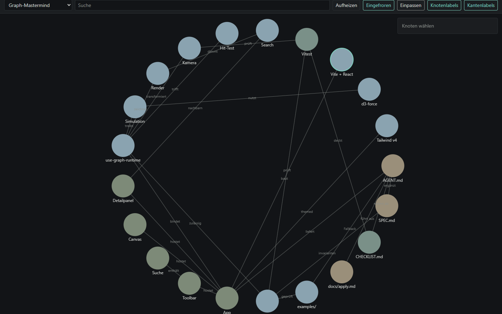
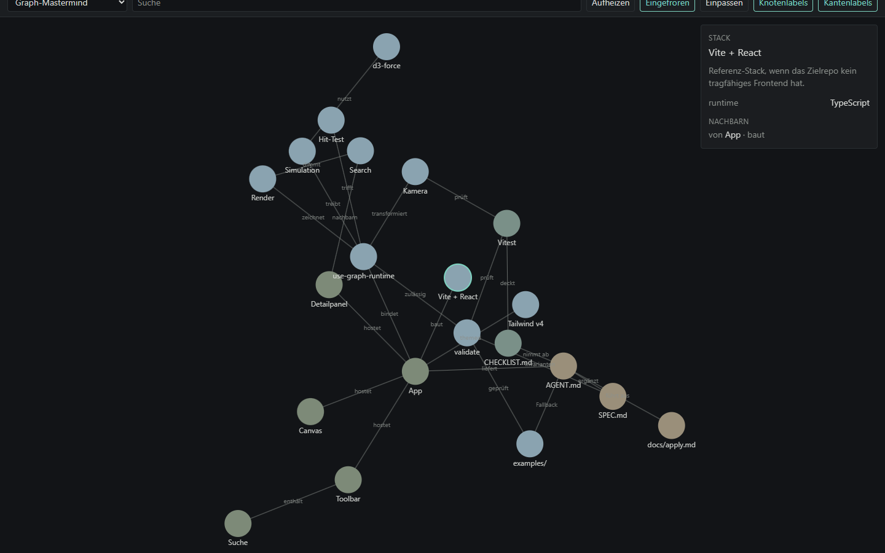
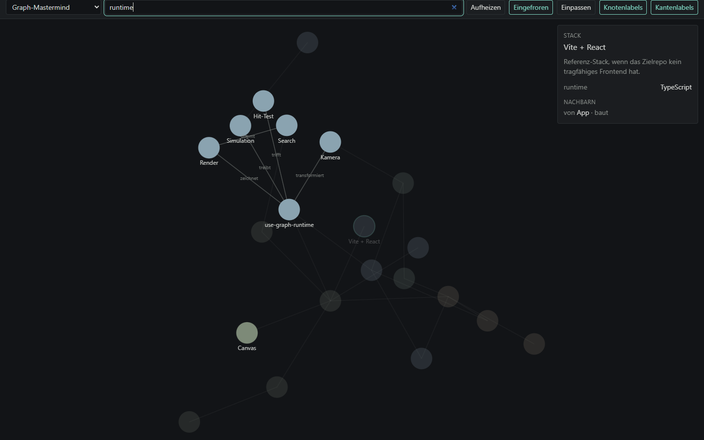
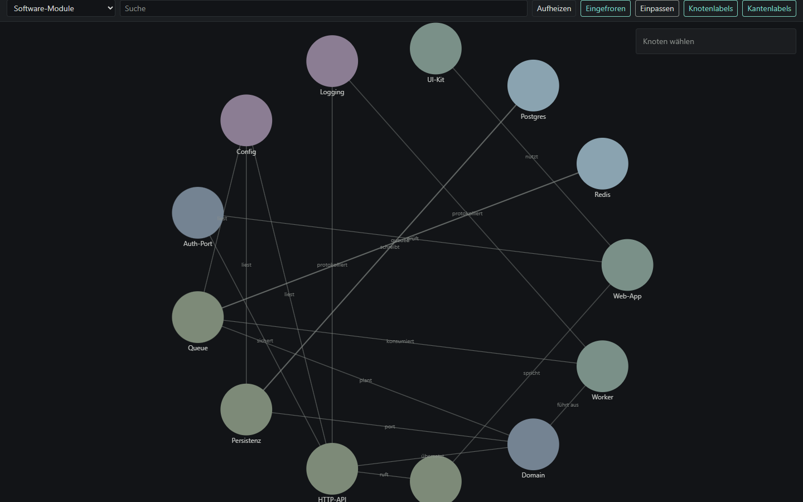

# Graph-Mastermind

Reusable agent package: point a coding agent at `AGENT.md` and get a
fullscreen force-directed graph of the **current** repository.

Wiederverwendbares Agent-Paket. Der Agent scannt das Zielrepo, leitet
Knoten und Kanten ab und liefert eine bedienbare Canvas-SPA. Kein Auth,
kein Backend, keine Setup-Fragen.

**[Live-Demo](https://graph-mastermind.vercel.app)** — Referenz-App mit
dem Graphen dieses Repositories und fünf umschaltbaren Samples.

[](https://graph-mastermind.vercel.app)

*Default-Sicht: Paket, Runtime, UI und Stack von Graph-Mastermind.*

---

## Warum das existiert

Repo-Struktur steckt in Dateibäumen, Importen und Docs. Die will man
sehen, nicht erraten. Graph-Mastermind macht daraus einen Graphen, den
man ziehen, suchen und erklären kann.

Zwei Lieferungen, ein Vertrag:

| Teil | Aufgabe |
|---|---|
| `AGENT.md` + `SPEC.md` + `CHECKLIST.md` | System-Prompt. Ein Agent wendet das Paket auf ein fremdes Repo an. |
| `graph-explorer/` | Referenz-SPA. Dieselbe Runtime, die der Agent kopiert. |

Die App ist kein Spielzeuggraph. Positionen leben in `d3-force` und in
Refs. Simulation-Ticks schreiben keinen React-State.

---

## Live

[graph-mastermind.vercel.app](https://graph-mastermind.vercel.app)

| Sicht | Was du siehst |
|---|---|
| [Übersicht](docs/screenshots/overview.png) | Force-Layout, Kantenlabels, Toolbar |
| [Auswahl](docs/screenshots/detail.png) | Detailpanel: Meta und Nachbarn |
| [Suche](docs/screenshots/search.png) | Treffer hell, Rest gedimmt |
| [Dataset-Wechsel](docs/screenshots/modules.png) | Sample „Software-Module“ |
| [Schmal](docs/screenshots/mobile.png) | Toolbar umgebrochen, Canvas bleibt nutzbar |



*Klick auf „Vite + React“: Gruppe, Beschreibung, Meta, Nachbarn.*



*Query `runtime`: die Runtime-Schicht bleibt lesbar, der Rest tritt zurück.*



*Umschalter auf das Fallback „Software-Module“. Suche und Selection sind leer, die Simulation startet neu.*

---

## Architektur

```
graph-mastermind/
  AGENT.md                 System-Prompt, allein ausführbar
  SPEC.md                  Features, Datenmodell, Interaktion, Design
  CHECKLIST.md             Abnahme eines Laufs im Zielprojekt
  LICENSE
  docs/
    apply.md               Kurzanweisung für Coding-Agents
    screenshots/           README-Aufnahmen der Referenz-App
  examples/                Projektgraph + fünf Fallback-Datasets
  graph-explorer/          Referenz-SPA (Vite, React, Canvas 2D)
    src/graph/             Runtime zum Kopieren
    src/ui/                Toolbar, Canvas, Suche, Detailpanel
    src/data/graphs.ts     Datasets, kein Fetch
  .github/workflows/ci.yml test, typecheck, production build
```

Runtime-Vertrag, unverändert zu `SPEC.md`:

```
tick  →  dirty = true          (kein setState)
rAF   →  zeichnen wenn dirty
idle  →  Loop schläft, Event weckt
```

`use-graph-runtime` verdrahtet Simulation, Kamera, Hit-Test und Render.
Die UI hält nur das, was ein Mensch umschaltet: Dataset, Suche,
Selection, Freeze, Label-Flags.

---

## Datasets

Default ist der Graph **dieses** Repos. Die fünf Samples sind Fallback
für Zielprojekte ohne tragbaren Kontext — und in der Demo umschaltbar.

| Dataset | Herkunft |
|---|---|
| Graph-Mastermind | Abgeleitet aus diesem Paket |
| Software-Module | `examples/dependency-graph.json` |
| Team und Verantwortung | `examples/team-graph.json` |
| Fachliche Konzepte | `examples/domain-graph.json` |
| Datenmodell | `examples/datamodel-graph.json` |
| Verarbeitungskette | `examples/pipeline-graph.json` |

---

## Lokal

```bash
git clone https://github.com/d0npedro/graph-mastermind.git
cd graph-mastermind/graph-explorer
npm install
npm run dev
```

```bash
npm test
npm run typecheck
npm run build
```

Vite wählt den Port. Wenn 5173 belegt ist, nimmt es den nächsten.

---

## Bedienung

- Ziehen: Knoten verschieben
- Rad: Zoom zur Cursorposition
- Ziehen auf Leere: Pan
- Klick: Details
- Doppelklick Leere: einpassen; Doppelklick Knoten: zentrieren
- Suche, Freeze, Reheat, Fit, Labels: Toolbar

---

## In ein anderes Projekt holen

```bash
cd /pfad/zum/zielprojekt
git clone https://github.com/d0npedro/graph-mastermind.git
```

Dem lokalen Agenten die URL oder diesen Satz geben:

```text
https://github.com/d0npedro/graph-mastermind
Lies AGENT.md und baue für dieses Repo den Netzwerkgraphen.
```

Ausführliche Agent-Schritte: [`docs/apply.md`](docs/apply.md).
Gesetz ist `AGENT.md`. Features: `SPEC.md`. Abnahme: `CHECKLIST.md`.

Ergebnis typisch unter `graph-explorer/`. Existiert die Installation
schon (`.graph-mastermind.json` oder `use-graph-runtime.ts`), wird
keine zweite App aufgesetzt.

---

## Technik

- React 19, TypeScript, Vite 6
- Tailwind CSS v4 (`@theme`-Tokens, kein `tailwind.config.js`)
- `d3-force` auf einem Canvas, nicht als SVG-Schwarm
- Vitest für Kamera, DPR, Pin, Suche, Validierung
- CI auf `main`: test, typecheck, production build

Harte Grenzen: kein Auth, kein Pflicht-Backend, kein Multiplayer,
kein Purple-Glow, keine Emojis in der UI.

---

## Lizenz

MIT. Siehe [`LICENSE`](LICENSE).
